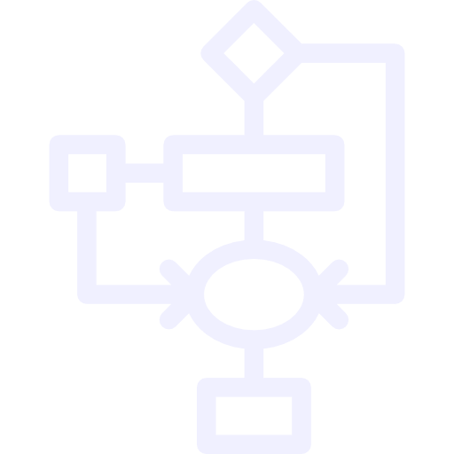

```{r, include = FALSE}

# Knitr Settings
knitr::opts_chunk$set(out.width = "60%",
                      echo = FALSE,
                      fig.align = "center",
                      message = FALSE,
                      echo = FALSE,
                      warning = FALSE,
                      dpi = 400)

# Packages
library(tidyverse)
library(plotly)
library(leaflet)
library(htmltools)
```

class: title-slide center

# Git Started

## `r format(Sys.time(), '%d %B, %Y')`

## Michael Harper

```{r, out.width = "50%"}
knitr::include_graphics("images/git-logo.png")
```

.footer[These slides available at <http://bit.ly/myslides>]

---

# Intro

---

# Resources


---

# Benefits when working alone


--- 
# What

When we update something, what do we want to know:

- Who made it?
- Why was the change?
- When was it made?


---
class: inverse, center, middle

# Changes in Workflow

```{r, out.width="30%"}

```

---

## Separating Data and Code

- *git* is designed primarly for **code** storage & outputs
- 

---

## Collaborative Report Writing


---

## Other Issues?


---
class: inverse, center, middle

# Looking Beyound

---


