```{r, include = FALSE}

# Knitr Settings
knitr::opts_chunk$set(out.width = "100%",
                      echo = FALSE,
                      fig.align = "center",
                      message = FALSE,
                      echo = FALSE,
                      warning = FALSE,
                      dpi = 400)

# Packages
library(tidyverse)
library(plotly)
library(leaflet)
library(htmltools)
```

class: title-slide middle

.pull-left[
# Git Started

-------

`r format(Sys.time(), '%d %B, %Y')`

Michael Harper
]

.pull-right[
```{r, out.width = "100%"}
knitr::include_graphics("images/git-logo.png")
```
]

---
# Overview

1. What is git?
2. Why should be use it?
3. Changes in Workflow
4. Next Steps

> The presentation is **not a technical guide** on how to use git. Once you understand why to you should use it, it will make it easier to withstand the technical headaches which can occasionally happen.

---
# What is Git

.pull-left[
>  Git is a piece of software that allows you to perform version control. Large projects require some piece of software to keep track of all the different changes made  in order to track things like: who edited a certain file; what they changed; and how to get back to the original code if necessary. 

- *Git* and *GitHub* are often synonymous but there are several online hosting services available
- Other services are available such as *GitLab*, *BitBucket* etc.
]

.pull-right[
```{r, out.width="60%"}
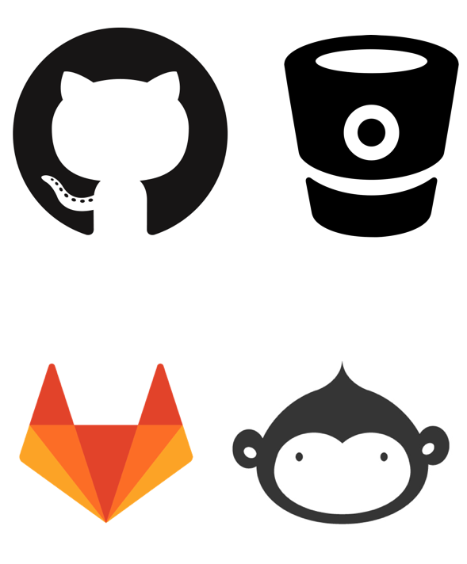
```
]

---
# Common symptons of a need for git

.pull-left[
```{r, out.width="60%"}

```
]

--

- You make **backups** of your code/project at semi-regular intervals

--

- Backups are made by copying all your code into a zip file

--

- You have **multiple people** working on the same project and need

--

- You want to **experiment** with new features of a code base

--

- You need to occasionaly **rerun old versions** of analysis

--

- You work with Michael Harper

---
# File Management Mayham Montage

.pull-left[
Examples of my own workflow before I discovered the full benefits of *git*!

- Random naming conventions of files
- Versioning of code by copying
- Having no backup copies can be just as much of a problem as having too many backups.
]

.pull-right[
```{r, out.width = "120%"}
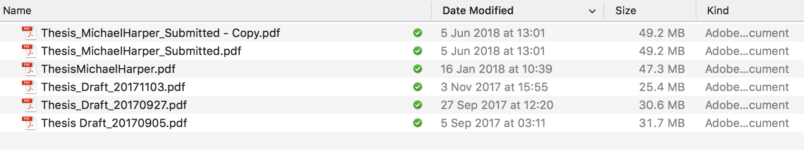
```

```{r, out.width = "120%"}
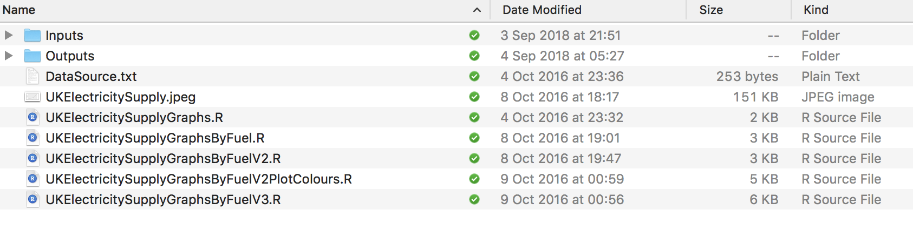
```

```{r, out.width = "120%"}
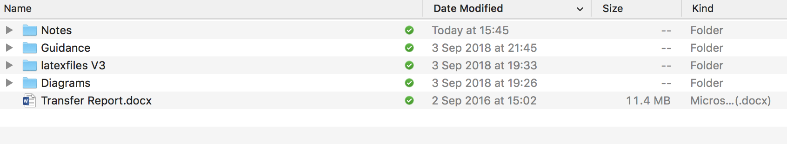
```
]

---
# How Git Works

.pull-left[

- Code stored on a central **repository**
- Each collaborator connects to repository and has a **local copy** of files
- **Edit** our own copies locally
- Changes be **committed** to the central repository

]

.pull-right[
```{r, out.width = "130%"}
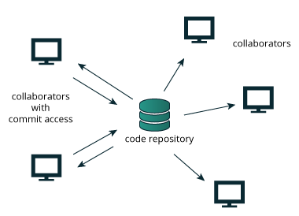
```
]

---
class: center, middle

```{r}
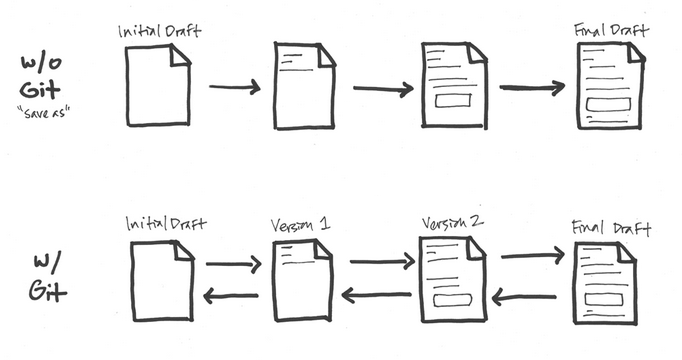
```

---
# Be clear about file changes

.pull-left[
Traditional file management only tells us a small portion of what we need to know. Git forces us to be explicit in our changes:

- **Who** made the changes?
- **What** happened?
- **Where** were the changes made?
- **When** did it take place?
- **Why** did that happen?

When we make changes with *git*, we must be explicit about the changes we made.
]

.pull-right[
```{r, out.width = "100%"}
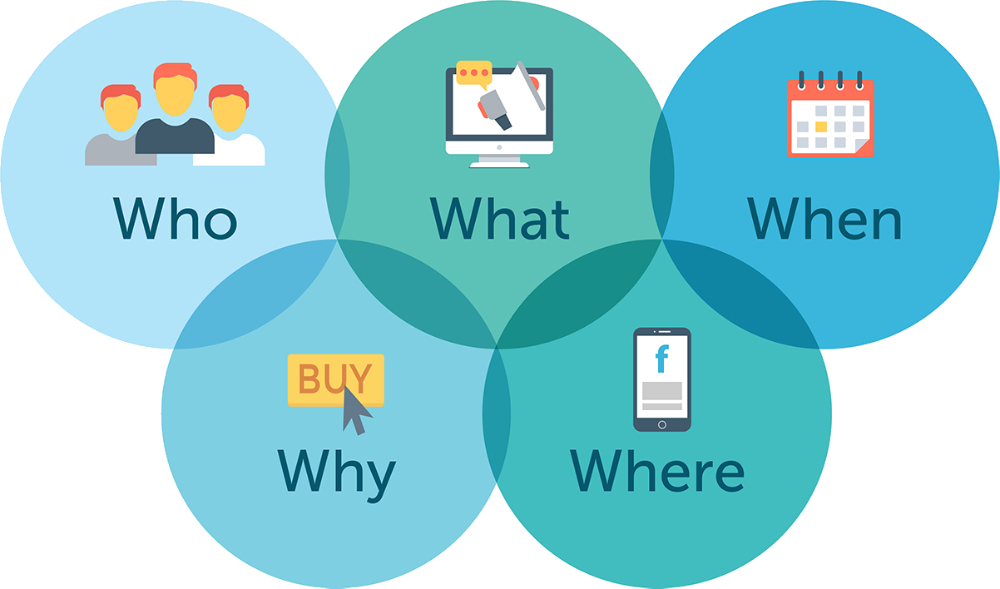
```
]

---
# Adding New Features

- We can add a **fork** which allows us to develop a new branch of the project
- Lets us test ideas without breaking the main branch
- Once feature is ready, we can merge the changes with the original code

```{r, out.width = "100%"}
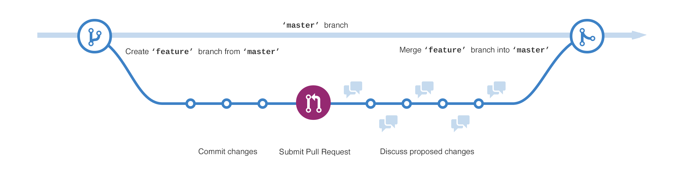
```

---
class: inverse, center, middle
# Changes in Workflow

```{r, out.width="30%"}
knitr::include_graphics("images/workflow.png")
```

---
# Sharing of Code

.pull-left[

**Existing**:

- *"Currently if someone else wants to work on code, the main person has to “pause” on their analysis so that we can keep track of the changes"*
- No more WorldPop drive or emails!
- Quickly lose control over the versions and which is the most up-to-date

**With GitHub**:

- Repositories can be **public** or **private**
- We can invite collaborators to our projects
- Rather than emailing code, we can direct them to website
- Always has the latest version of the code
]


.pull-right[
```{r, out.width="100%"}
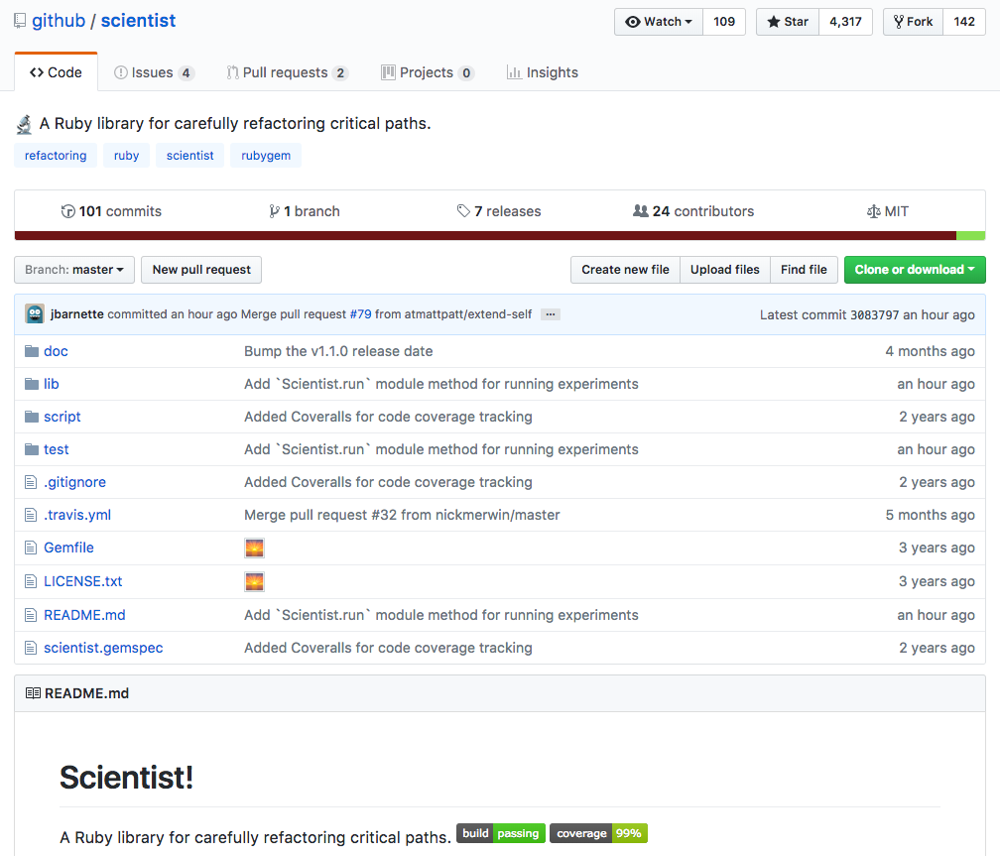
```
]

---
# Separating Data and Code

.pull-left[

**Existing**:

- code and data often live in the same folder
- Can make sharing things difficult without sending the whole directory
- Duplicate datasets

**The GitHub way**:

- *git* is designed primarly for **code** storage & outputs
- **Data** must be stored elsewhere and linked to from the repository.
  - Shared Drives
  - Web Servers

]

.pull-right[
```{r}

```
]

---
# Versioning

.pull-left[

**Existing:**

- Backup our code
- Change file names to append versions


**The GitHub Way**:

- We can add versions to the code to flag releases
- Add notes about what changes happened at our release
- Important if we release data that we can reproduce the results
]

.pull-right[
```{r}
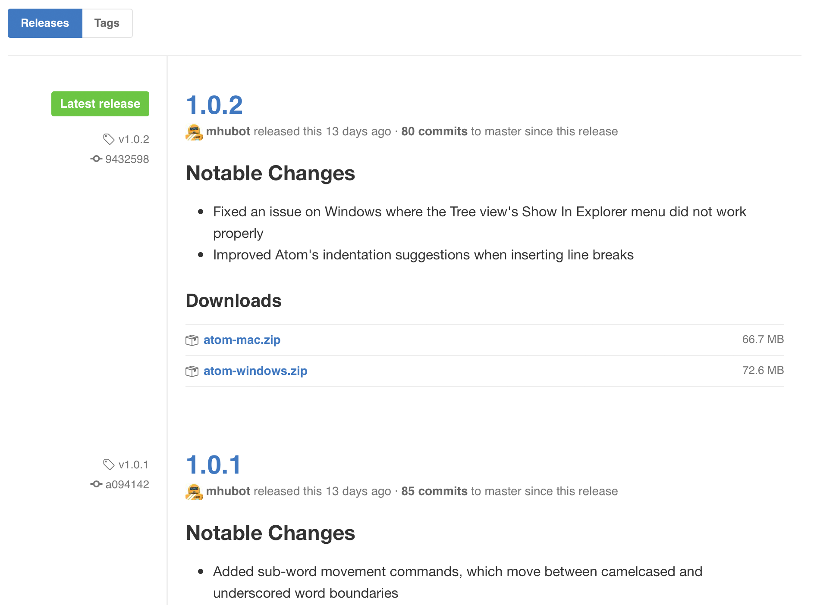
```
]

---
# More Open Coding

.pull-left[

**Existing:**

- Code in isolation
- Difficult to share and get input from others
- Encourages bad practise

**The GitHub Way**:

- Github encourages more open programming
- Easily share your code with others
- Forces us to think at an early stage how we might make it easier for others to use
]

.pull-right[
```{r}
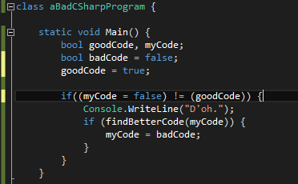
```
]

---
# Tracking Issues

.pull-left[

**Existing:**

- Emails
- READMEs?

**The GitHub Way**:

- We can add **Issues** directly the repository
- Flag known bugs
- Discuss solutions to problems, request input from others
- Prioritise which to target first
]

.pull-right[
```{r}
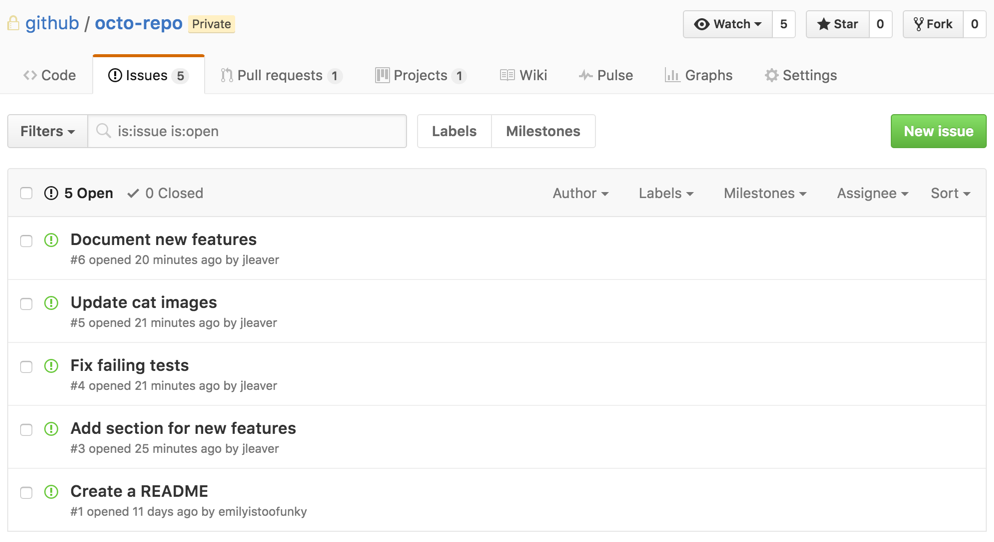
```
]

---
class: inverse, center, middle
# Looking Beyond the Basics

```{r, out.width = "35%"}

```

What opportunities does GitHub offer?

---
# Automated Testing

.pull-left[
- We can integrate third-party services to our repositories
- Continuous integration (CI) allows for updates and tests to be automated
- If someone makes changes to the code which breaks it, you will know before it gets deployed
]

.pull-right[
```{r, out.width="60%"}
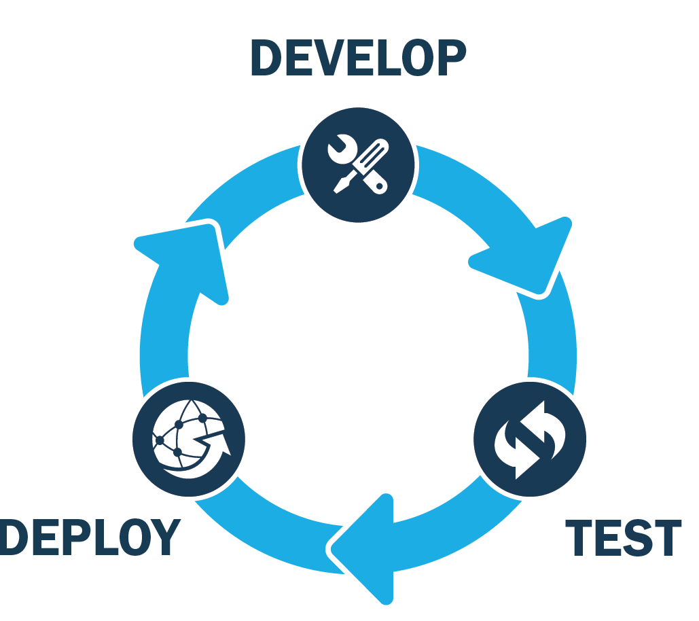
```
]

---
# Documentation

- Can use GitHub to deploy websites for package documentation.
- Example of [polyCheck](https://grid3.github.io/polyCheck/) package

```{r, out.width="60%"}
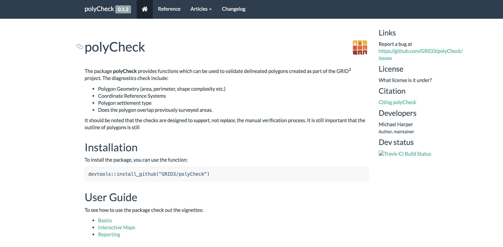
```

---
class: inverse, center, middle
# Next Steps

---
# Potential Hurdles

.pull-left[
- Technical learning curve
- Restructuring of projects
- Interaction with non-technical partners

]

.pull-right[
```{r}
knitr::include_graphics("https://media0.giphy.com/media/xTiTnooneW4SYfch8Y/giphy.gif?cid=3640f6095bc9b96749355572671b42da")
```
]

---
# Getting Started

.pull-left[
- Encourage you to set up personal projects before joining a group project
- Git can be controlled by command line, but [GitHub Desktop](https://desktop.github.com/) is very useful
- There are good online resources
- Further training to be provided in future seminars
]

.pull-right[
**Pro Git**: free download of eBook on Amazon: http://amzn.eu/d/4Uvv5Tc

```{r, out.width="60%"}
knitr::include_graphics("https://images-na.ssl-images-amazon.com/images/I/41qIcWnG8-L._SX404_BO1,204,203,200_.jpg")
```
]

---
class: inverse, center, middle
# Any Questions?


```{r, out.width = "50%"}
knitr::include_graphics("images/git-logo.png")
```


