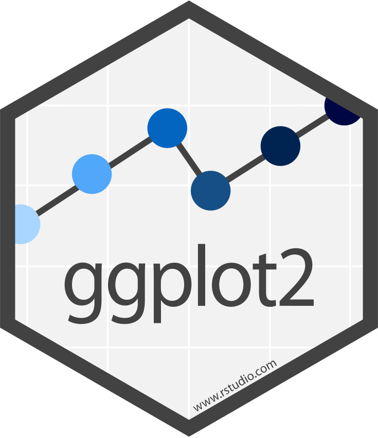
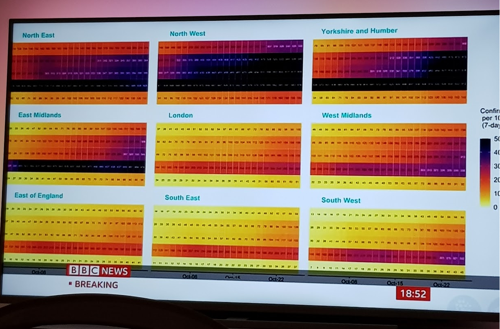
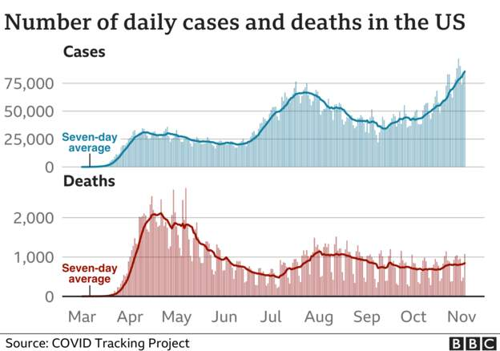
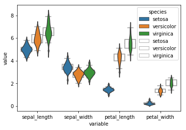

```{r setup, include=FALSE}
library(tidyverse)
library(patchwork)
library(plotly)

knitr::opts_chunk$set(message = FALSE, fig.align = "center", dev = "svg", out.width = "50%")
```

class: center, top, inverse

# http://ggplot2.tidyverse.org/

```{r, echo = F, out.width="40%"}

```


---

class: center, middle, inverse

> "The simple graph has brought more information to the data analyst’s mind than any other device." --- John Tukey


---

class: center, middle, inverse

# Examples


.pull-left[
You may have seem this last week!

```{r, echo=FALSE, out.width="100%"}

```
]

.pull-right[
Or on the BBC Covid updates:
```{r,  echo=FALSE, out.width="100%"}

```
]

---

class: center, middle, inverse

# Introduction

---

## ggplot2 and the *Grammar of Graphics*

> *"a tool that enables us to concisely describe the components
of a graphic. Such a grammar allows us to move beyond named graphics (e.g., the “scatterplot”) and gain insight into the deep structure that underlies statistical graphics"*. [Hadley Wickham](https://byrneslab.net/classes/biol607/readings/wickham_layered-grammar.pdf) 

.pull-left[

]

.pull-right[

The general structure of code can be broken down into the core components:

```
ggplot(data = <DATA>) + 
  <GEOM_FUNCTION>(
     mapping = aes(<MAPPINGS>),
     stat = <STAT>, 
     position = <POSITION>
  ) +
  <COORDINATE_FUNCTION> +
  <FACET_FUNCTION>
```
]

**You can uniquely describe any plot as a combination of these 7 parameters.**

---

## Why use ggplot2?

</br>

- Easy superposition, facetting, etc.
- Nice rendering
- Code is very readable
- Highly customisable
- Lots of users (less bugs, much help on Stack Overflow).
- Lots of extensions
- Nice saving option.

</br>

**The code to make a basic plot in ggplot may at first seem longer, but the same syntax can be used to make more complex plots too!**

---

## Tidy data

**ggplot2** is pretty strict in expecting data to be in a long format!

```{r, echo=FALSE, out.width="80%"}
knitr::include_graphics("http://r4ds.had.co.nz/images/tidy-1.png")
```

<br>

Learn more at http://tidyr.tidyverse.org/articles/tidy-data.html.

---

## So data shouldn't look like this...

Untidy data: always an upsetting sight to see!

```{r, include=FALSE}
library(tidyverse)
fertilityData <- structure(list(Country = structure(c(2L, 5L, 6L, 
9L, 11L, 12L, 13L, 14L, 15L, 16L, 17L, 18L), .Label = c("Abkhazia", 
"Afghanistan", "Akrotiri and Dhekelia", "Åland", "Albania", 
"Algeria", "American Samoa", "Andorra", "Angola", "Anguilla", 
"Antigua and Barbuda", "Argentina", "Armenia", "Aruba", "Australia", 
"Austria", "Azerbaijan", "Bahamas", "Bahrain", "Bangladesh", 
"Barbados", "Belarus", "Belgium", "Belize", "Benin", "Bermuda", 
"Bhutan", "Bolivia", "Bosnia and Herzegovina", "Botswana", "Brazil", 
"British Virgin Islands", "Brunei", "Bulgaria", "Burkina Faso", 
"Burundi", "Cambodia", "Cameroon", "Canada", "Cape Verde", "Cayman Islands", 
"Central African Republic", "Chad", "Channel Islands", "Chile", 
"China", "Christmas Island", "Cocos Island", "Colombia", "Comoros", 
"Congo, Dem. Rep.", "Congo, Rep.", "Cook Is", "Costa Rica", "Cote d'Ivoire", 
"Croatia", "Cuba", "Cyprus", "Czech Republic", "Czechoslovakia", 
"Denmark", "Djibouti", "Dominica", "Dominican Republic", "East Germany", 
"Ecuador", "Egypt", "El Salvador", "Equatorial Guinea", "Eritrea", 
"Eritrea and Ethiopia", "Estonia", "Ethiopia", "Faeroe Islands", 
"Falkland Is (Malvinas)", "Fiji", "Finland", "France", "French Guiana", 
"French Polynesia", "Gabon", "Gambia", "Georgia", "Germany", 
"Ghana", "Gibraltar", "Greece", "Greenland", "Grenada", "Guadeloupe", 
"Guam", "Guatemala", "Guernsey", "Guinea", "Guinea-Bissau", "Guyana", 
"Haiti", "Holy See", "Honduras", "Hong Kong, China", "Hungary", 
"Iceland", "India", "Indonesia", "Iran", "Iraq", "Ireland", "Isle of Man", 
"Israel", "Italy", "Jamaica", "Japan", "Jersey", "Jordan", "Kazakhstan", 
"Kenya", "Kiribati", "Kosovo", "Kuwait", "Kyrgyz Republic", "Lao", 
"Latvia", "Lebanon", "Lesotho", "Liberia", "Libya", "Liechtenstein", 
"Lithuania", "Luxembourg", "Macao, China", "Macedonia, FYR", 
"Madagascar", "Malawi", "Malaysia", "Maldives", "Mali", "Malta", 
"Marshall Islands", "Martinique", "Mauritania", "Mauritius", 
"Mayotte", "Mexico", "Micronesia, Fed. Sts.", "Moldova", "Monaco", 
"Mongolia", "Montenegro", "Montserrat", "Morocco", "Mozambique", 
"Myanmar", "Namibia", "Nauru", "Nepal", "Netherlands", "Netherlands Antilles", 
"New Caledonia", "New Zealand", "Ngorno-Karabakh", "Nicaragua", 
"Niger", "Nigeria", "Niue", "Norfolk Island", "North Korea", 
"North Yemen (former)", "Northern Cyprus", "Northern Mariana Islands", 
"Norway", "Oman", "Pakistan", "Palau", "Panama", "Papua New Guinea", 
"Paraguay", "Peru", "Philippines", "Pitcairn", "Poland", "Portugal", 
"Puerto Rico", "Qatar", "Reunion", "Romania", "Russia", "Rwanda", 
"Samoa", "San Marino", "Sao Tome and Principe", "Saudi Arabia", 
"Senegal", "Serbia", "Serbia and Montenegro", "Serbia excluding Kosovo", 
"Seychelles", "Sierra Leone", "Singapore", "Slovak Republic", 
"Slovenia", "Solomon Islands", "Somalia", "Somaliland", "South Africa", 
"South Korea", "South Ossetia", "South Yemen (former)", "Spain", 
"Sri Lanka", "St. Barthélemy", "St. Helena", "St. Kitts and Nevis", 
"St. Lucia", "St. Martin", "St. Vincent and the Grenadines", 
"St.-Pierre-et-Miquelon", "Sudan", "Suriname", "Svalbard", "Swaziland", 
"Sweden", "Switzerland", "Syria", "Taiwan", "Tajikistan", "Tanzania", 
"Thailand", "Timor-Leste", "Togo", "Tokelau", "Tonga", "Transnistria", 
"Trinidad and Tobago", "Tunisia", "Turkey", "Turkmenistan", "Turks and Caicos Islands", 
"Tuvalu", "Uganda", "Ukraine", "United Arab Emirates", "United Kingdom", 
"United Korea (former)\n", "United States", "Uruguay", "USSR", 
"Uzbekistan", "Vanuatu", "Venezuela", "Vietnam", "Virgin Islands (U.S.)", 
"Wallis et Futuna", "West Bank and Gaza", "West Germany", "Western Sahara", 
"Yemen", "Yugoslavia", "Zambia", "Zimbabwe"), class = "factor"), 
    `1800` = c(7, 4.6, 6.99, 6.93, 5, 6.8, 7.8, 5.64, 6.5, 5.1, 
    8.1, 5.9), `1801` = c(7, 4.6, 6.99, 6.93, 5, 6.8, 7.8, 5.64, 
    6.48, 5.1, 8.1, 5.9), `1802` = c(7, 4.6, 6.99, 6.93, 4.99, 
    6.8, 7.81, 5.64, 6.46, 5.1, 8.1, 5.9), `1803` = c(7, 4.6, 
    6.99, 6.93, 4.99, 6.8, 7.81, 5.64, 6.44, 5.1, 8.1, 5.9), 
    `1804` = c(7, 4.6, 6.99, 6.93, 4.99, 6.8, 7.81, 5.64, 6.42, 
    5.1, 8.1, 5.9), `1805` = c(7, 4.6, 6.99, 6.93, 4.98, 6.8, 
    7.82, 5.64, 6.4, 5.1, 8.1, 5.9)), .Names = c("Country", 
"1800", "1801", "1802", "1803", "1804", "1805"), row.names = c(NA, 
-12L), class = c("tbl_df", "tbl", "data.frame"))
```

```{r, echo = F}
knitr::kable(head(fertilityData))
```


---

## ... but look like this!

```{r warning=FALSE, message=FALSE, cache=FALSE}
fertilityTidy <- fertilityData %>%
   pivot_longer(-Country, names_to = "Year",
                values_to = "Fertility") %>%
   mutate(Year = as.integer(Year))

```

```{r, echo = F}
knitr::kable(head(fertilityTidy))
```

Tidy data with the variables are the **country**, **year** and **fertility rate**. That is much better!


---

class: center, middle, inverse

# Let's get plotting: basics and customisation

---

### Out first basic plot

As a minimum, plot will assign `ggplot`, a `geometry` and the `aesthetics`:

```{r, fig.asp = 0.7}
ggplot(data = fertilityTidy) + 
  geom_point(mapping = aes(x = Year, y = Fertility))
```

---

### Drop extra typing

Most of the time people drop the `mapping` and `data` typing:

```{r, fig.asp = 0.7}
ggplot(fertilityTidy) + 
  geom_point(aes(x = Year, y = Fertility))
```

---

### Add colors

Add a `colour` aes to the `geom_point`:

```{r, fig.asp = 0.7}
ggplot(fertilityTidy) + 
  geom_point(aes(Year, Fertility, color = Country))
```

---

### Add lines: add one geom

We can easily add multiple geometries to the graph:

```{r, fig.asp = 0.7}
ggplot(fertilityTidy) + 
  geom_point(aes(Year, Fertility, color = Country)) + 
  geom_line(aes(Year, Fertility, color = Country))
```

---

### Remove redundancy: move 'aes' to the top

Anything set within the `ggplot` function will be inherited across all geoms.

```{r, fig.asp = 0.7}
ggplot(fertilityTidy, aes(Year, Fertility, color = Country)) + 
  geom_point() +
  geom_line()
```

---

### Larger points and lines

Can alter line sizes, styles etc. See `?geom_point` for more details:

```{r fig.asp = 0.7}
ggplot(fertilityTidy, aes(Year, Fertility, color = Country)) + 
  geom_point(size = 4) +
  geom_line(size = 3)
```

---

class: center, middle, inverse

# Layers 

---

### Iris: base dataset of R

For these examples we will use `iris` dataset:

```{r, echo = F}
knitr::kable(head(iris, n = 10))
```

---

### Layers: example with geom_smooth()

```{r fig.asp = 0.7}
ggplot(iris, aes(Petal.Length, Petal.Width)) + 
  geom_point(aes(color = Species, shape = Species), size = 3)
```

---

### Geom_smooth on all

```{r fig.asp = 0.7}
ggplot(iris, aes(Petal.Length, Petal.Width)) + 
  geom_point(aes(color = Species, shape = Species), size = 3) + 
  geom_smooth(color = "black")
```

---

### Points on top: change the order of layers

Layers are added in order they are written. 

```{r fig.asp = 0.7}
ggplot(iris, aes(Petal.Length, Petal.Width)) + 
  geom_smooth(color = "black") + 
  geom_point(aes(color = Species, shape = Species), size = 3)
```

---

### Geom_smooth by group

Add `group` aesthetic to the `geom_smooth`:

```{r fig.asp = 0.7}
ggplot(iris, aes(Petal.Length, Petal.Width)) + 
  geom_smooth(aes(group = Species), color = "black") + 
  geom_point(aes(color = Species, shape = Species), size = 3)
```

---

### Or use color for both geoms

```{r fig.asp = 0.7}
ggplot(iris, aes(Petal.Length, Petal.Width, color = Species)) + 
  geom_smooth() + 
  geom_point(aes(shape = Species), size = 3)
```

---

class: center, middle, inverse

# Coordinates, Facets and Layouts

---

### Coordinates

the `scale_x_...` and `scale_y_...` allow us to customise scale types, limits etch

```{r fig.asp = 0.7}
ggplot(iris) + 
  geom_point(aes(Petal.Length, Petal.Width, 
                 color = Species, shape = Species), size = 3) + 
  scale_x_log10(breaks = 1:7)
```

---

### Facets

```{r fig.asp = 0.6}
ggplot(iris) + 
  geom_point(aes(Petal.Length, Petal.Width, 
                 color = Species, shape = Species), size = 3) + 
  facet_grid(~ Species)
```

---

### Labels

Use the `labs` option to easily add labels:

```{r fig.asp = 0.6}
ggplot(iris) + 
  geom_point(aes(Petal.Length, Petal.Width, 
                 color = Species, shape = Species), size = 3) + 
  labs(title = "Comparison of Iris Species", x = "Petal Length", y = "Petal Width", subtitle = "Look at my interesting results", caption = "Data source: X")
```

---

### Futher customization: themes

We can customise the appearance of the plots using `theme`.

```{r}
ggplot(fertilityTidy, aes(Year, Fertility, color = Country)) + 
  geom_point(size = 4) +
  geom_line(size = 3) +
  theme(legend.key.width = unit(3, "line"),
        panel.background = element_rect(fill = "grey20"))
```

---

### Themes

If you don't like the default styling, you can easily change with built in options. There is a relatively limited choice within ggplot itself. 

```{r, echo = F, fig.asp = 0.7}
p <- ggplot(iris) + 
  geom_point(aes(Petal.Length, Petal.Width, 
                 color = Species, shape = Species), size = 3) 

p1 <- p + theme_light() + theme(legend.position = "none")
p2 <- p + theme_classic() + theme(legend.position = "none")
p3 <- p + theme_void() + theme(legend.position = "none")

p1 + p2 + p3
```

---

### Themes (continued)

However there is a great package for themes call **ggthemr**. 

```{r, echo = FALSE, out.width="100%", fig.asp=0.4}

p <- ggplot(iris) + 
  geom_point(aes(Petal.Length, Petal.Width, 
                 color = Species, shape = Species), size = 3)

# If looking at this code, don't use it like this. It is much better just to set it globally at the start of your script
p1 <- p + labs(title = "dust") + ggthemr::ggthemr('dust', set_theme = FALSE)$theme +
  theme(legend.position = "none")
p2 <- p + labs(title = "light") + ggthemr::ggthemr('light', set_theme = FALSE)$theme +
  theme(legend.position = "none")
p3 <- p + labs(title = "flat") + ggthemr::ggthemr('flat', set_theme = FALSE)$theme +
  theme(legend.position = "none")
p4 <- p + labs(title = "chalk") + ggthemr::ggthemr('chalk', set_theme = FALSE)$theme +
  theme(legend.position = "none")

p1 + p2 + p3 + p4 + plot_layout(nrow = 1)

```

---

### Layout Combine plots with patchwork

Additional package **patchwork** used for plotting. Allows you to output multiple plots by using `+` between ggplot objects:

```{r out.width = "85%", fig.asp = 1}

baseplot <- ggplot(iris, aes(x = Petal.Length, y = Petal.Width)) + 
  theme(legend.position = "none")

p1 <- baseplot + geom_point(aes(shape = Species,  color = Species))
p2 <- baseplot + geom_smooth()
p3 <- baseplot + geom_hex() 
p4 <- baseplot + geom_path() 

p1 + p2 + p3 + p4
```


---

class: center, middle, inverse

# Extension: Interactive Plots

---

### Interactive plots

```{r, out.width="80%", fig.asp=0.7, cache=FALSE}
p <- ggplot(iris, aes(Petal.Length, Petal.Width, 
                   color = Species, shape = Species)) + 
  geom_point(size = 3)

plotly::ggplotly(p, width = 700, height = 300)
```

---

class: center, middle, inverse

# Python Thoughts? 

---

### Comparison with seaborn / matplotlib 

Say we want to get our output:

```{r, echo =F}

```

**Note, I use this as an example, but don't think it is a great way to visualise the data!** Example from [here](https://www.datisticsblog.com/2018/08/r2py_matplotlib_seaborn/)

---

### Comparison with seaborn / matplotlib

Wriiting this in Seaborn / Matplotlib:

```{}
# instantiate axis and figure
fig, ax = plt.subplots()

ax = sns.violinplot('variable', 'value', data = df_melt
               , hue = 'species'
               , inner = None ## removes inner boxes
               , ax = ax
               , legend_out = True
              )

ax = sns.boxplot('variable', 'value', data = df_melt
            , hue = 'species'
            , palette = ['#FFFFFF','#FFFFFF','#FFFFFF']
            , saturation = 1
            , ax = ax
           )
```

---

### Comparison with seaborn / matplotlib (2)

```{}
# the boxes are drawn onto the axis as artist objects
for artist in ax.artists:
    artist.set_edgecolor('black')
    artist.set_zorder(1)
    
# the caps and whiskers as line objects
for line in ax.lines:
    line.set_color('black')

# get legend handles and labels before drawing legend
# use only 3 of them for legend
handles, labels = ax.get_legend_handles_labels()
plt.legend(handles[0:3], labels[0:3]
          , bbox_to_anchor=(1.05, 1), loc=2, borderaxespad=0.)
```

---

### Comparison with seaborn / matplotlib (4)

How to do it in ggplot

```{r}
df_melt <- 
  iris %>%
  pivot_longer(cols = -Species, names_to = "variable")

ggplot(df_melt, aes(x = variable, y = value, fill = Species)) +
  geom_boxplot(width = 1, alpha = 0, colour = "grey30") +
  geom_violin(width = 1, trim = F, scale = "width", alpha = 0.5) +
  theme(legend.position =  "top")
```

---

### Integration with Python

- Given that most our data science workflows are in Python, how could this integrate?
- Could the be used in conjunction with typical workflows?
- `rpy2` library to link R and Python: https://stackoverflow.com/questions/35152395/using-r-in-python-with-rpy2-how-to-ggplot2
- `plotnine` as a Python implementation of ggplot: https://plotnine.readthedocs.io/en/stable/

---

### Learn more

- [Chapter *Data Visualisation*](http://r4ds.had.co.nz/data-visualisation.html) of R For Data Science
- [The ggplot book](https://ggplot2-book.org/)
- [ggplot Cheatsheet](https://rstudio.com/wp-content/uploads/2015/03/ggplot2-cheatsheet.pdf)

.pull-left[

]

.pull-right[

]

.footnote[Freely available online.]

---

### Miscellaneous

- [Pie charts](https://guangchuangyu.github.io/2016/12/scatterpie-for-plotting-pies-on-ggplot/) but [others plots are often better](http://annkemery.com/pie-chart-guidelines/)

- [Spatial Visualization](https://cran.r-project.org/web/packages/ggmap/index.html)

- [Heatmaps](http://blog.aicry.com/r-heat-maps-with-ggplot2/)

- [Cookbook for R - Graphs](http://www.cookbook-r.com/Graphs/)

- [**Cheatsheet**](https://www.rstudio.com/wp-content/uploads/2016/11/ggplot2-cheatsheet-2.1.pdf)

- [Top 50 ggplot2 Visualizations](http://r-statistics.co/Top50-Ggplot2-Visualizations-MasterList-R-Code.html)

- [**Viridis color palette**](https://cran.r-project.org/web/packages/viridis/vignettes/intro-to-viridis.html)

- [**An RStudio addin for ggplot2 theme tweaking**](https://github.com/calligross/ggthemeassist)

- [**Publication Ready Plots**](http://www.sthda.com/english/rpkgs/ggpubr/)

- [Extensions](https://exts.ggplot2.tidyverse.org/)


---

class: center, middle, inverse

# Thanks!

<br>

Presentation available at

https://dr-harper.github.io/presentations/2010-ggplot/ggplot.html

<br>

.footnote[Slides created via the R package [**xaringan**](https://github.com/yihui/xaringan).]