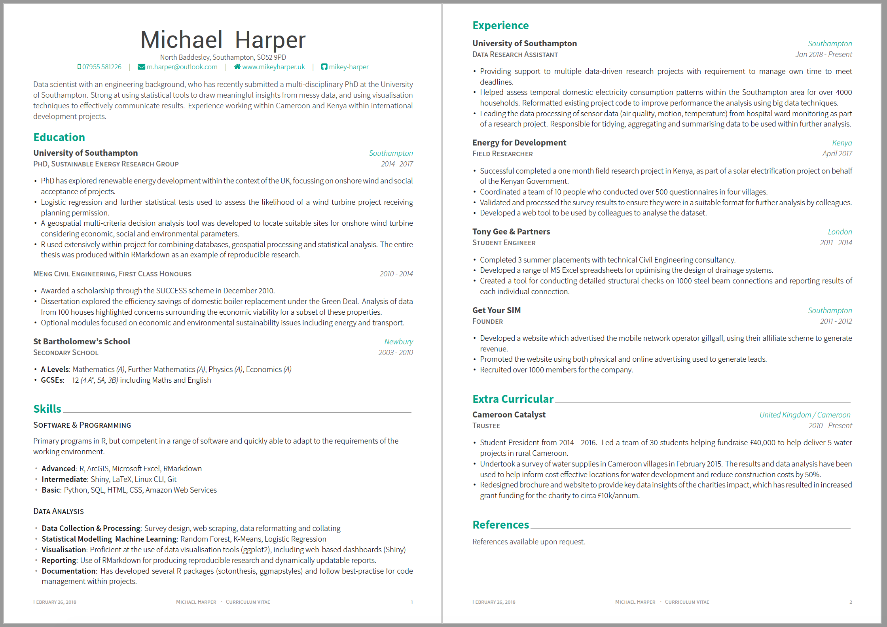
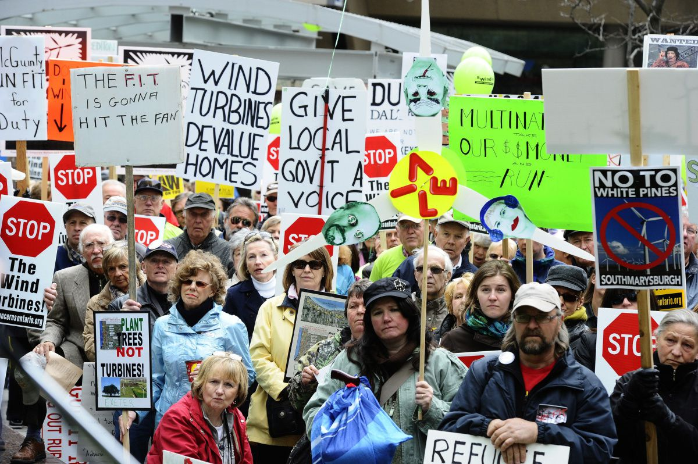
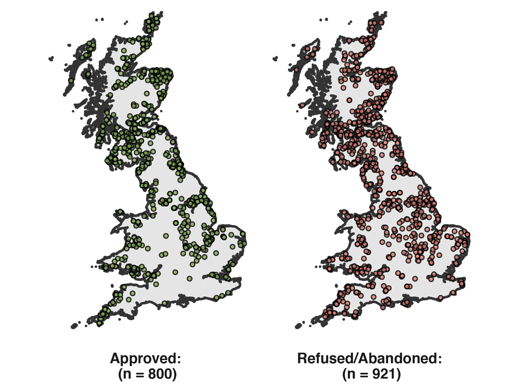
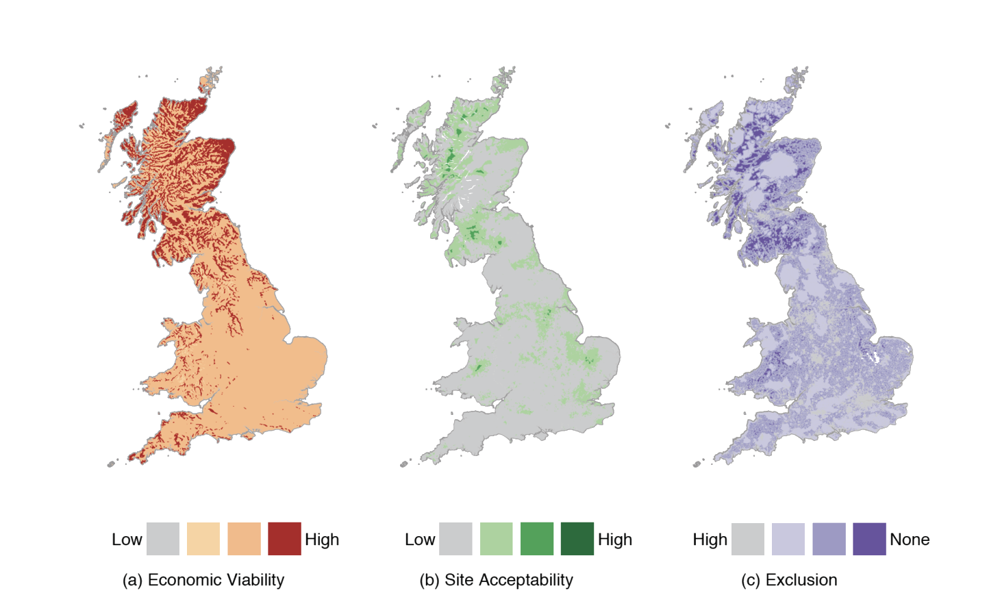
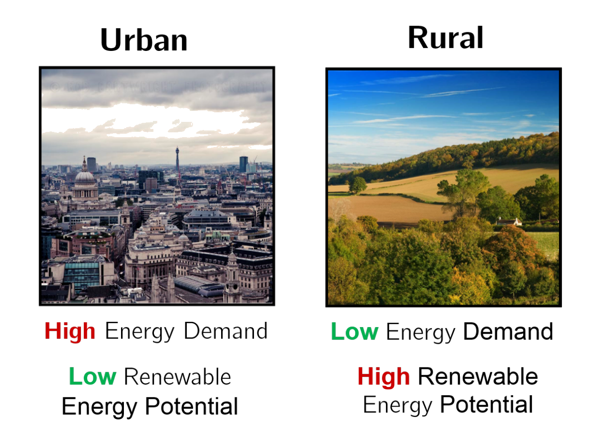
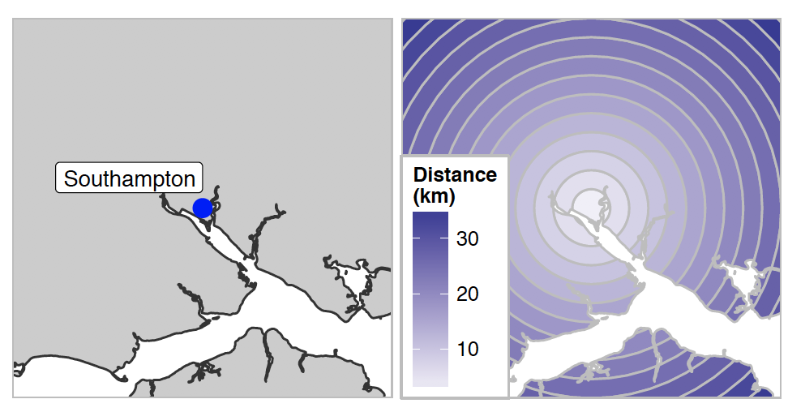
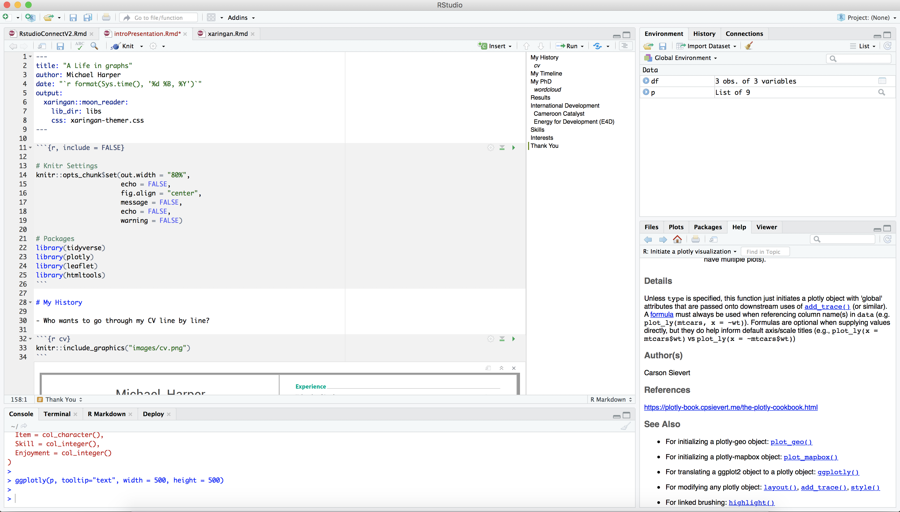

```{r, include = FALSE}

# Knitr Settings
knitr::opts_chunk$set(out.width = "60%",
                      echo = FALSE,
                      fig.align = "center",
                      message = FALSE,
                      echo = FALSE,
                      warning = FALSE,
                      dpi = 400)

# Packages
library(tidyverse)
library(plotly)
library(leaflet)
library(htmltools)
```

# My History

- Who wants to go through my CV line by line?

```{r cv}

```

---

# My Timeline

- The pathway to an "Implementation Analyst"

```{r, fig.asp = 0.5, out.width="80%"}

read_csv("data/timeline.csv") %>%
  gather("Attribute", "Value", 2:7) %>%
  mutate(Attribute = factor(Attribute, levels = c("Programmer", "Geographer", "Engineer", "Statistician", "Mathematician", "Geek"))) %>%
  ggplot(aes(Year, Value, fill = Attribute)) +
  geom_area(alpha = 0.8, colour = "grey90") +
  scale_x_continuous(limits = c(2008, 2018), breaks = 2008:2018, expand = c(0,0)) +
  scale_y_continuous(limits = c(0, 1.1), breaks = seq(0, 1, by = 0.2), expand = c(0,0)) +
  scale_fill_brewer(type = "qual", palette = "Paired") + 
  labs(y = "What do I consider myself as?") +
  theme(panel.grid.minor  = element_blank(),
        panel.grid.major.x = element_blank(),
        panel.background = element_rect(fill = "#E9EDEE"),
        plot.background = element_rect(fill = "#E9EDEE", colour = "#E9EDEE"),
        legend.background  = element_rect(fill = "#E9EDEE", colour = "#E9EDEE"))
```

---

# My PhD

.center["*Spatial planning scale for regional renewable energy supply in the UK context*"]

```{r wordcloud, out.width = "45%"}
knitr::include_graphics("images/phdwordcloud.png")
```

---

## Wind Turbine Planning Acceptance

.pull-left[
- Onshore wind has the lowest acceptance rates of onshore wind
- An abundance of GIS models to locate sites, but few tried to understand acceptance rates


```{r, out.width = "100%"}

```

]

.pull-right[
```{r acceptanceRates, fig.width = 5, out.width = "100%", fig.asp = 1}
# A summary table was made to convert the summary status
planning_summary <- read.table(text = "
'Status'	                    'Status Summary'
'Application Approved'	      'Approved'
'Application Refused'	        'Refused/Abandoned'
'Application Submitted'	      'Submitted'
'Application Withdrawn'	      'Refused/Abandoned'
'Connection Applied For'	    'Submitted'
'No Application Made'	        'Refused/Abandoned'
'No Application'              'Required	Approved'
'Abandoned'	                  'Refused/Abandoned'
'Awaiting Construction'	      'Approved'
'Decommissioned'	            'Approved'
'Operational'	                'Approved'
'Planning Permission Expired'	'Approved'
'Under Construction'	        'Approved'
", header = TRUE, stringsAsFactors = FALSE)

REPD_count <-
read.csv(file = "data/Public_Database_-_Feb_2018.csv", check.names = TRUE, as.is = TRUE) %>%
  filter(Country != "Northern Ireland") %>%
  merge(planning_summary, by.x = "Development.Status..short.", by.y = "Status") %>%
  dplyr::select(Technology.Type, Status.Summary) %>%
  set_names(c("Tech", "Status")) %>%
  table() %>%
  as.data.frame() %>%
  reshape2::dcast(Tech ~ Status, value.var = "Freq") %>%
  mutate(n = rowSums(.[2:4]),
         App_perc = `Approved`/n)

# Convert to long for plotting
REPD_count_long <-
  REPD_count %>%
  reshape2::melt(id = c("Tech", "n", "App_perc")) %>%
  set_names(c("Technology", "Group_Total", "Perc_Approv", "Status", "Count")) %>%
  mutate(Status = factor(Status, levels = c("Approved", "Submitted", "Refused/Abandoned")),
         Technology = factor(Technology, levels = rev(REPD_count$Tech[order(REPD_count$App_perc)])),
         percent = Count/Group_Total) %>%
  filter(Group_Total > 50)

# Plot the results
ggplot(REPD_count_long, aes(x = Technology, y = Count, fill = Status)) +
  geom_bar(position = "fill", stat = "identity", alpha = 0.9, width = 0.7, color = "grey20") +
  geom_text(aes(y = percent, label=ifelse(percent >= 0.07, paste0(sprintf("%.0f", percent*100),"%"),"")),
                position=position_stack(vjust=0.5), colour="grey20", size = 3) +
  coord_flip() +
  theme(legend.position = "top") +
  scale_fill_manual(values = c("#bae19b", "#fee08b", "#fb6b27")) +
  scale_y_continuous(labels = scales::percent, expand = c(0,0)) +
  scale_x_discrete(labels = function(x) str_wrap(x, width = 20)) +
  labs(x = "", y = "") +
  guides(fill = guide_legend(reverse = TRUE)) +
  theme(panel.background = element_rect(fill = "#E9EDEE"),
        plot.background = element_rect(fill = "#E9EDEE", colour = "#E9EDEE"),
        legend.background  = element_rect(fill = "#E9EDEE", colour = "#E9EDEE"))
```
]

---

## Can we predict site acceptance?

.pull-left[
- Over 1700 previous planning applications between 1990 and 2015
- Collected over 30 geospatial covariates
    - Political
    - Socio-demographic
    - Geospatial proximity
- Logistic regression model to assess likelihood of planning acceptance
- Geospatial parameters in isolation are not great predictors
- Coming to a journal near you soon (hopefully)
]

.pull-right[
```{r, out.width="100%"}

```
]

---

## Locating Wind Turbines

```{r, out.width = "80%"}

```

?
- Assessing planning acceptance, economic viability and legislative constraints.
- Formed a geospatial multi-criteria decision analysis model (GIS MCDA).
- Based on outputs of first layer of analysis.

---

## Spatial Scale in Energy Systems

- Energy systems are inherently spatial: demand and supply rarely happen at the same place.

```{r, out.width = "40%"}

```

- How do cities meet renewable energy targets in the future?

## Assessing Spatial Scale

- Most models assume a fixed spatial scale i.e. How much renewable energy can we supply in Hampshire?
- 


```{r, out.width = "50%"}

```

---
class: inverse, center, middle

# Life Outside the PhD

---

# International Development

.pull-left[

### Cameroon Catalyst

- Trustee.
- Help construct water resources in Eastern Cameroon
- Visited in 2014 to conducted surveys of water resources.

### Energy for Development (E4D)

- Build solar electrification projects in off-grid villages
- Surveyed sites for new projects in 2017 and 2018
]

.pull-right[
```{r, out.width="100%", dpi = 92}

df <- read.csv(textConnection(
"Name,Lat,Long
Cameroon,3.52,11.31
Kenya,-1.16,36.48
Uganda,1.3733,32.2903"
))

leaflet(df) %>%
  setView(20, 1, zoom = 03) %>%
  addProviderTiles(providers$Esri.NatGeoWorldMap) %>%
  addMarkers(~Long, ~Lat, popup = ~htmlEscape(Name))

```
]

---

# SAVE Project

- Real-time electricity consumption analysis of 4000 households in Southampton

```{r}
knitr::include_graphics("images/worldCup.gif")
```

---

# Skills

```{r, fig.asp=1, out.width = "45%"}

shading <- read_csv("data/shading.csv")
interests <- read_csv("data/skillsInterests.csv")

p <-
  ggplot() +
  geom_rect(data = shading, aes(xmin = Xmin, xmax = Xmax, ymin = Ymin, ymax = Ymax,  fill = Shading), alpha = 0.8) +
  scale_fill_manual(values = c("#91cf60", "#fc8d59", "#ffffbf")) +
  geom_point(data = interests, aes(Skill, Enjoyment)) +
  ggrepel::geom_label_repel(data = interests, aes(Skill, Enjoyment, label = Item), nudge_x = 0.4) +
  coord_equal(xlim = c(0,10), ylim = c(0,10)) +
  theme(legend.position = "none")
p
```

---

# R

.pull-left[

- Literate programming
- R packages


]

.pull-right[
```{r, fig.cap="ggmapstyles pacakge" }
knitr::include_graphics("https://github.com/dr-harper/ggmapstyles/raw/master/man/figures/README-maps-1.png")
```
]

---

class: inverse, center, middle

# Thank You

```{r, fig.cap="This presentation was brought to you by R Markdown", out.width = "50%"}

```
